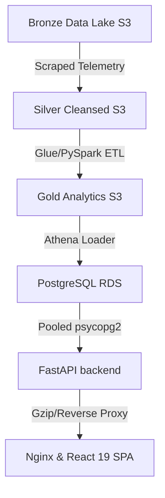

# CareerPulse


CareerPulse is a cloud-native job market intelligence platform. It processes raw job listings, aggregates industry metrics (companies, skills, technology, salaries, and geographies), and exposes this information via a performant FastAPI service and a premium React 19 Executive Dashboard.

---

## 🏗️ System Architecture



Detailed architectural diagrams and component descriptions can be found in [docs/architecture_overview.md](architecture_overview.md).

---

## 🛠️ Technology Stack

* **Frontend:** React 19, Vite, TypeScript, Tailwind CSS v4, Recharts, TanStack Query, Axios
* **Backend:** FastAPI, Uvicorn, Python 3.12, PostgreSQL (psycopg2)
* **Infrastructure & ETL:** Docker, Nginx, AWS Glue, AWS S3, AWS Athena, GitHub Actions

---

## 🌟 Core Features

1. **Executive Summary Dashboard:** Aggregates platform KPIs (total jobs, companies, remote ratio, average salary, top skills) with visual bar/donut charts.
2. **Interactive Analytics Pages:** Dedicated detail pages for Companies, Skills, Technology, Geography, and Salary.
3. **URL Search Parameter Persistence:** Browser URL search parameters reflect current search queries, sort orders, and pagination indices.
4. **Platform Operations Telemetry:** Active Nginx and FastAPI health checks, database link diagnostics, and dataset load freshness details from the database view.
5. **Production-Grade Infrastructure:** Multi-stage Docker files, Nginx reverse proxying, gzip caching controls, Makefile automations, and GitHub Actions CI pipelines with container smoke tests.

---

## 📸 Dashboard Preview

### Executive Summary View
*Visual placeholder showing dashboard charts*

### Detailed Analytics Table
*Visual placeholder showing search, sort, and pagination grid*

---

## 🚀 Quick Start (Local Docker Compose)

1. **Configure Environment Variables:**
   ```bash
   cp .env.example .env
   cp backend/.env.example backend/.env
   cp frontend/.env.example frontend/.env
   ```
2. **Build and Run Containers:**
   ```bash
   make build
   make up
   ```
3. **Access Services:**
   * **Dashboard App:** [http://localhost](http://localhost) (Proxied via Nginx)
   * **FastAPI Backend Swagger Docs:** [http://localhost:8000/docs](http://localhost:8000/docs) (Direct access)
   * **Local Database pgAdmin Console:** [http://localhost:5050](http://localhost:5050)

---

## 📚 Platform Documentation

* [Developer Setup Guide](developer_setup.md)
* [Production Deployment Guide](deployment.md)
* [Architecture Design Document](architecture_overview.md)
