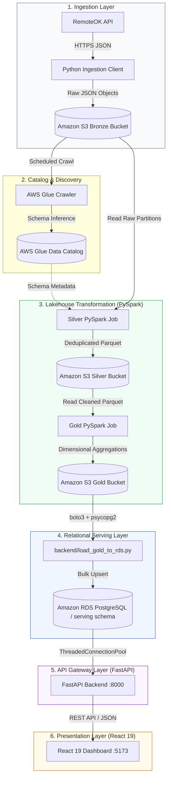

# CareerPulse — Cloud-Native Job Market Intelligence Platform

[](https://github.com/ShashankMk031/careerpulse)
[](https://python.org)
[](https://fastapi.tiangolo.com)
[](https://react.dev)
[](https://www.typescriptlang.org)
[](https://www.postgresql.org)
[](https://aws.amazon.com)
[](LICENSE)

**CareerPulse** is an enterprise-grade, cloud-native job market intelligence platform. It systematically extracts unstructured remote job postings from external job boards (RemoteOK API), routes data through an AWS Medallion Lakehouse (Bronze $\rightarrow$ Silver $\rightarrow$ Gold) with PySpark, loads aggregated dimensional models into an Amazon RDS PostgreSQL instance, and serves real-time market analytics via a FastAPI REST service and a high-performance React 19 Executive Dashboard.

---

## Table of Contents

1. [Project Overview](#1-project-overview)
2. [System Architecture](#2-system-architecture)
3. [Prerequisites](#3-prerequisites)
4. [AWS Infrastructure & IAM Configuration](#4-aws-infrastructure--iam-configuration)
5. [Environment Configuration](#5-environment-configuration)
6. [Ingestion Pipeline](#6-ingestion-pipeline)
7. [AWS Glue Lakehouse Pipeline (Bronze → Silver → Gold)](#7-aws-glue-lakehouse-pipeline-bronze--silver--gold)
8. [RDS Serving Layer Setup & Data Load](#8-rds-serving-layer-setup--data-load)
9. [FastAPI Backend Service](#9-fastapi-backend-service)
10. [React Executive Dashboard](#10-react-executive-dashboard)
11. [Testing & Quality Assurance](#11-testing--quality-assurance)
12. [Production Deployment](#12-production-deployment)
13. [Cost Controls & Cloud Budget Strategy](#13-cost-controls--cloud-budget-strategy)
14. [Troubleshooting & FAQ](#14-troubleshooting--faq)

---

## 1. Project Overview

Finding actionable employment trends in tech requires moving beyond static search boards. CareerPulse addresses this by automating the complete data lifecycle:
- **Scalable Ingestion:** Extracts raw job listings with source tracking and error-tolerant retries.
- **Medallion Data Lakehouse:** Transforms raw JSON (Bronze) into cleaned Snappy Parquet (Silver) and dimensional aggregates (Gold) using serverless AWS Glue PySpark jobs.
- **Low-Latency Serving:** Loads dimensional aggregates into Amazon RDS PostgreSQL with connection pooling (`ThreadedConnectionPool`) and precomputed views.
- **Instrumented API Gateway:** FastAPI ASGI service with Pydantic validation, GZip compression, request correlation IDs (`X-Request-ID`), and sub-millisecond database profiling headers (`X-Database-Time-MS`).
- **Executive Analytics UI:** React 19 single-page application built with Vite, TanStack Query, Tailwind CSS v4, and Recharts, featuring full dark/light theme switching, responsive layouts, and URL-synchronized search filters.

---

## 2. System Architecture



*For detailed architectural rationale, design trade-offs, and component deep dives, see [docs/architecture.md](docs/architecture.md).*

---

## 3. Prerequisites

Ensure your development environment meets the following specifications:
- **Operating System:** macOS, Linux, or Windows WSL2
- **Python:** `3.12.x`
- **Node.js:** `20.x` or `22.x` (with `npm 10+`)
- **Docker & Docker Compose:** Docker Engine $\ge 24.0$
- **AWS CLI:** Version 2.x configured with programmatic credentials (`aws configure`)
- **PostgreSQL Client (Optional):** `psql` 16.x for direct database inspection

---

## 4. AWS Infrastructure & IAM Configuration

The cloud pipeline operates across four managed AWS services in region `ap-south-1`:
- **Amazon S3:** Bucket `cp-dev-datalake-<ACCOUNT_ID>` with `bronze/`, `silver/`, `gold/`, and `scripts/` prefixes.
- **AWS Glue:**
  - Database: `cp_dev_catalog`
  - Crawler: `cp_dev_bronze_crawler`
  - PySpark ETL Jobs: `cp_dev_silver_etl` (2 DPUs) and `cp_dev_gold_etl` (2 DPUs)
- **IAM Role:** `cp-dev-glue-role` with `AWSGlueServiceRole` and read/write policies on the S3 data bucket.
- **Amazon RDS:** `cp-dev-serving-db` (`db.t4g.micro`, PostgreSQL 16.13, single-AZ).

---

## 5. Environment Configuration

The repository uses standard 12-factor environment variables. Initialize configuration files:

```bash
# 1. Global / Root Environment
cp .env.example .env

# 2. Backend Environment
cp backend/.env.example backend/.env

# 3. Frontend Environment
cp frontend/.env.example frontend/.env
```

### Essential Root `.env` Settings:
```env
APP_ENV=development
DB_ENVIRONMENT=RDS

# Serving Database Credentials
DATABASE_HOST=cp-dev-serving-db.c123456789.ap-south-1.rds.amazonaws.com
DATABASE_PORT=5432
DATABASE_NAME=serving_db
DATABASE_USER=postgres
DATABASE_PASSWORD=your_secure_password
DATABASE_SCHEMA=serving

# Allowed CORS Origins
CORS_ORIGINS=http://localhost:5173,http://127.0.0.1:5173,http://localhost

# AWS Configuration
AWS_REGION=ap-south-1
S3_BUCKET=cp-dev-datalake-321422008826
```

---

## 6. Ingestion Pipeline

To fetch the latest raw job market listings and store them into S3 Bronze:

```bash
# Activate virtual environment
source venv/bin/activate

# Execute ingestion client
python ingestion/main.py
```
*Outputs an immutable JSON object to `s3://<S3_BUCKET>/bronze/source=remoteok/year=YYYY/month=MM/day=DD/`.*

---

## 7. AWS Glue Lakehouse Pipeline (Bronze → Silver → Gold)

Deploy and execute the Glue data transformation jobs:

```bash
# 1. Deploy Glue Jobs & Crawlers to AWS
python scripts/deploy_glue.py
python scripts/deploy_glue_silver.py
python scripts/deploy_glue_gold.py

# 2. Run Silver ETL (Cleansing, Salary Normalization, Deduplication)
aws glue start-job-run --job-name cp_dev_silver_etl --region ap-south-1

# 3. Run Gold ETL (Dimensional Aggregation for Serving)
aws glue start-job-run --job-name cp_dev_gold_etl --region ap-south-1
```
*For detailed schema transformation logic, see [docs/data-flow.md](docs/data-flow.md).*

---

## 8. RDS Serving Layer Setup & Data Load

The serving layer normalizes Gold Parquet datasets into relational tables inside the `serving` schema.

```bash
# Execute Gold-to-RDS loader
source venv/bin/activate && python backend/load_gold_to_rds.py
```
*This validates all 6 Gold datasets (`company`, `skills`, `geography`, `salary`, `technology`, `summary`) against Pydantic schemas, runs an atomic bulk upsert transaction, and logs metadata into `serving.load_metadata`.*

---

## 9. FastAPI Backend Service

Run the REST API service locally:

```bash
source venv/bin/activate
uvicorn backend.app.main:app --host 0.0.0.0 --port 8000 --reload
```

### Health & Readiness Verification:
```bash
# Verify API process liveness and active database connectivity
curl -s http://127.0.0.1:8000/health | jq .
# Expected: {"success": true, "data": {"status": "healthy", "database": "connected"}}

# Verify dataset freshness sync logs
curl -s http://127.0.0.1:8000/metrics | jq .

# Verify interactive OpenAPI docs
open http://127.0.0.1:8000/docs
```
*Complete endpoint specifications and schemas are documented in [docs/api.md](docs/api.md).*

---

## 10. React Executive Dashboard

Launch the development frontend:

```bash
cd frontend
npm install
npm run dev
```
Open **[http://127.0.0.1:5173](http://127.0.0.1:5173)** in your browser.

### Monitored Routes:
- `/dashboard`: Executive market overview, KPI cards, Recharts visualizations.
- `/companies`: Filterable employer hiring directory with location counts.
- `/skills`: In-demand technical competencies and relative demand progress bars.
- `/technology`: Developer stack and runtime platform demand.
- `/geography`: Regional hiring density with cumulative dimension notices.
- `/salary`: Compensation bracket tier distributions (Entry, Mid, Staff).
- `/status`: Real-time system telemetry, database pool metrics, and sync lag.
- `/about`: 6-part architecture documentation and pipeline flow diagrams.

---

## 11. Testing & Quality Assurance

CareerPulse enforces continuous verification across backend and frontend codebases:

```bash
# 1. Run Backend Pytest Suite (103 tests)
source venv/bin/activate && PYTHONPATH=. pytest -q

# 2. Run Frontend Static Analysis Linter (oxlint)
npm --prefix frontend run lint

# 3. Run Frontend Vitest Suite (59 tests)
npm --prefix frontend run test

# 4. Verify Frontend Production TypeScript Build
npm --prefix frontend run build
```

---

## 12. Production Deployment

To run the complete production cluster with Nginx reverse proxying:

```bash
# Build and launch production containers
docker compose -f docker-compose.prod.yml build
docker compose -f docker-compose.prod.yml up -d

# Inspect health status
docker compose -f docker-compose.prod.yml ps
```
*For cloud deployment on EC2, ECS, or Kubernetes, see [docs/deployment.md](docs/deployment.md).*

---

## 13. Cost Controls & Cloud Budget Strategy

CareerPulse enforces strict budget constraints:
- **Glue 10-Minute Timeout:** Jobs specify `Timeout=10` to prevent runaway Spark workers.
- **Glue Minimum DPUs:** Explicitly allocated 2 DPUs ($0.88/hr), cutting costs by 80%.
- **RDS Single-AZ:** `db.t4g.micro` with manual stop commands when development pauses.
- **S3 Versioning Disabled:** Avoids multi-gigabyte accumulation of temporary Parquet iterations.

```bash
# Stop RDS instance when not actively developing:
aws rds stop-db-instance --db-instance-identifier cp-dev-serving-db --region ap-south-1
```
*Full cost breakdown and budget recommendations: [docs/cost.md](docs/cost.md).*

---

## 14. Troubleshooting & FAQ

| Problem | Cause | Quick Fix |
| :--- | :--- | :--- |
| **PostgreSQL connection timeout** | Developer public IP changed | Update RDS Security Group with your current IP (`curl -s https://api.ipify.org`). See [docs/troubleshooting.md](docs/troubleshooting.md). |
| **Port collision (`5432` in use)** | Local Postgres service running | Use port `5433` for local Docker or stop host service. |
| **CORS error in browser** | Missing frontend origin | Add your frontend URL to `CORS_ORIGINS` in `.env`. |
| **Glue job access denied** | Missing IAM S3 permissions | Verify `cp-dev-glue-role` has read/write permissions on the S3 bucket. |

*For in-depth remediation steps, consult [docs/troubleshooting.md](docs/troubleshooting.md).*

---

## 📄 License
This project is licensed under the MIT License — see the [LICENSE](LICENSE) file for details.
