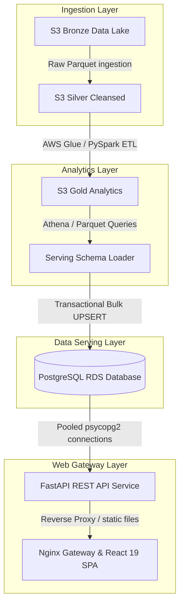

# CareerPulse System Architecture Overview

This document provides a high-level overview of the CareerPulse cloud-native job market intelligence system.

---

## 1. System Topology
The platform consists of a pipeline extracting job postings, cleaning text formats, and displaying visual analytics on an executive dashboard.

---

## 2. Platform Layers

### Data Lake (Bronze & Silver)
* Stores raw scraped job posting telemetry in Apache Parquet formats.
* Ingestion pipelines run normalizations on standard fields (job tags, descriptions, timestamps, salaries).

### Data Warehouse & ETL (Gold Layer)
* Implements multi-dimensional aggregate queries calculating job densities, employer hiring volumes, in-demand skills, and income distributions.
* Saves processed metrics as high-performance Gold-tier Parquet partitions.

### Serving Database Layer (PostgreSQL)
* Hosts serving schemas and transactional tables containing summary data.
* Implements the serving SQL database view `serving.v_dataset_status` providing pipeline loading logs, load age calculations, sync lag times, and fresh/stale status alerts.

### REST API Service (FastAPI)
* Implements a clean REST interface exposing analytics data through standardized response envelopes (`success`, `data`, `metadata`).
* Runs with GZip middleware compression, cache control policies, request ID logging filters, and custom exception handler mapping.

### View Presentation Layer (React 19 SPA)
* Renders metrics (KPI cards, Recharts horizontal/vertical graphs, and data tables) on a premium glassmorphic dashboard.
* Uses TanStack Query for connection caching and React Router for URL state persistence.
