# CareerPulse System Architecture

## 1. Executive Summary

**CareerPulse** is a production-grade, cloud-native Job Market Intelligence Platform designed to ingest, process, model, and serve real-time cloud and engineering employment data. The platform ingests telemetry from external job boards (RemoteOK API), routes data through an AWS Medallion Data Lakehouse (Bronze $\rightarrow$ Silver $\rightarrow$ Gold), aggregates dimensional metrics, serves them through an Amazon RDS PostgreSQL instance via a FastAPI REST API, and visualizes analytical insights using a React 19 Executive Dashboard.

---

## 2. End-to-End System Architecture

```mermaid
flowchart TD
    subgraph INGESTION["1. Ingestion Layer"]
        RO[RemoteOK API] -->|HTTPS JSON| PY_INGEST[Python Ingestion Client]
        PY_INGEST -->|Raw JSON Objects| S3_BRONZE[(Amazon S3 Bronze Bucket)]
    end

    subgraph CATALOG["2. Catalog & Discovery"]
        S3_BRONZE -->|Scheduled Crawl| GLUE_CRAWLER[AWS Glue Crawler]
        GLUE_CRAWLER -->|Schema Inference| GLUE_CATALOG[(AWS Glue Data Catalog)]
    end

    subgraph LAKEHOUSE["3. Lakehouse Transformation (AWS Glue PySpark)"]
        GLUE_CATALOG -.->|Catalog Metastore| GLUE_SILVER[Silver PySpark Job]
        S3_BRONZE -->|Read Raw Partitions| GLUE_SILVER
        GLUE_SILVER -->|Cleaned, Deduplicated Parquet| S3_SILVER[(Amazon S3 Silver Bucket)]

        S3_SILVER -->|Read Cleaned Parquet| GLUE_GOLD[Gold PySpark Job]
        GLUE_GOLD -->|Aggregated Dimensional Parquet| S3_GOLD[(Amazon S3 Gold Bucket)]
    end

    subgraph SERVING["4. Serving Layer (PostgreSQL)"]
        S3_GOLD -->|load_gold_to_rds.py| LOADER[Bulk Upsert Loader]
        LOADER -->|ACID Transactions| RDS_PG[(Amazon RDS PostgreSQL / serving schema)]
    end

    subgraph API["5. API Gateway Layer (FastAPI)"]
        RDS_PG -->|Pooled Connections| POOL[psycopg2 ThreadedConnectionPool]
        POOL --> API_ROUTERS[FastAPI Application Services]
        API_ROUTERS -->|JSON Envelopes + Timing Headers| FASTAPI[FastAPI Gateway :8000]
    end

    subgraph PRESENTATION["6. Presentation Layer (React 19)"]
        FASTAPI -->|REST API / JSON| TANSTACK[TanStack Query v5 Hooks]
        TANSTACK --> REACT_APP[React 19 Executive Dashboard]
        REACT_APP --> UI[Tailwind CSS v4 & Recharts Analytics]
    end

    style INGESTION fill:#f8fafc,stroke:#64748b,stroke-width:1px
    style LAKEHOUSE fill:#f0fdf4,stroke:#16a34a,stroke-width:1px
    style SERVING fill:#eff6ff,stroke:#2563eb,stroke-width:1px
    style API fill:#faf5ff,stroke:#9333ea,stroke-width:1px
    style PRESENTATION fill:#fffbeb,stroke:#d97706,stroke-width:1px
```

---

## 3. Architectural Rationale by Component

### 3.1 Why an AWS Medallion Data Lakehouse?
Directly writing scraped API payloads into a production relational database introduces severe operational risks: schema drift, unpredictable payload size, network timeouts, and non-reproducible transformations. The **Medallion Architecture** decouples collection from analytical consumption:

1. **Bronze Layer (`s3://.../bronze/`):**
   - **Purpose:** Immutable raw landing zone.
   - **Format:** Raw JSON files partitioned by date (`source=remoteok/year=YYYY/month=MM/day=DD/`).
   - **Rationale:** Preserves auditability and guarantees that upstream scraping can never corrupt downstream analytics. If ETL logic changes, historical snapshots can be reprocessed from Bronze without re-querying the upstream provider.

2. **Silver Layer (`s3://.../silver/`):**
   - **Purpose:** Cleansed, validated, and deduplicated records.
   - **Format:** Apache Parquet with Snappy compression, partitioned by ingestion date.
   - **Transformations:**
     - Type coercion (ISO timestamps, integer identifiers, sanitized strings).
     - Salary extraction: parsing salary boundaries (`salary_min`, `salary_max`) from compensation text strings.
     - Deduplication: composite key hashing on `(id, company, position)`.
     - Tag array explosion and normalization.

3. **Gold Layer (`s3://.../gold/`):**
   - **Purpose:** Business-level aggregated dimensional models.
   - **Format:** Parquet files optimized for analytical query workloads.
   - **Datasets Produced:**
     - `company_analytics`: Total jobs, location counts, salary spreads, and top paying roles.
     - `skills_analytics`: Job demand counts, average salary ranges, remote listing counts.
     - `geography_analytics`: Country and regional density, remote vs. onsite distributions.
     - `salary_analytics`: Standardized compensation bracket distributions.
     - `technology_analytics`: Tooling and stack demand metrics.
     - `hiring_summary`: Platform-wide executive KPI snapshot.

### 3.2 Why AWS Glue with PySpark?
- **Serverless Scaling:** AWS Glue provides a fully managed Apache Spark environment without requiring persistent EMR clusters.
- **Cost Efficiency:** Jobs run with minimum DPU allocation (2 DPUs) and strict 10-minute timeouts, keeping execution costs under pennies per run.
- **Job Bookmarks:** Glue job bookmarks prevent reprocessing unchanged Bronze files, ensuring incremental ingestion efficiency.

### 3.3 Why Amazon RDS PostgreSQL for Serving?
While Parquet in S3 is ideal for batch transformation and Athena queries, object stores are suboptimal for user-facing interactive dashboards:
- Athena queries incur 2–5 seconds of latency and query-scan costs ($5/TB scanned).
- PostgreSQL provides sub-50ms indexed queries, predictable response times, and full ACID guarantees.
- Connection pooling via `psycopg2.pool.ThreadedConnectionPool` reuses existing TCP sockets, eliminating connection handshake overhead on high-frequency dashboard queries.

### 3.4 Why FastAPI?
- **High Concurrency:** Asynchronous ASGI architecture capable of handling high request volumes with minimal memory overhead.
- **Automatic Contract Generation:** Native Pydantic model serialization generates OpenAPI 3.1 specifications (`/docs`, `/redoc`, `/openapi.json`) automatically.
- **Low Latency:** In-memory response caching headers (`Cache-Control: public, max-age=...`) and GZip compression for payloads exceeding 1 KB.
- **Instrumentation:** Context-aware logging middleware outputs structured JSON telemetry with `X-Process-Time-MS` and `X-Database-Time-MS` response headers.

### 3.5 Why React 19 + TanStack Query?
- **Client-Side Caching:** TanStack Query caches API responses in browser memory, preventing redundant backend requests on tab navigation.
- **URL-Driven State:** Filter parameters, search queries, sort orders, and pagination indices are synchronized to browser search parameters (`useSearchParams`), enabling shareable deep links.
- **Predictable Error Boundaries:** Reusable UI components handle empty, loading (skeleton), and error states without application crashes.
