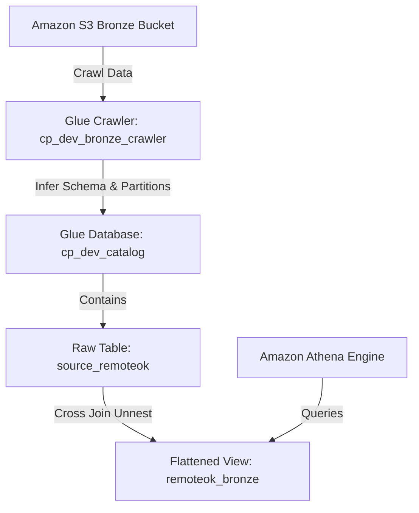

# Sprint 3 AWS Glue Metadata Layer Architecture

This document describes the design and configuration of the Glue Metadata Layer and Amazon Athena integration for **CareerPulse**.

---

## 1. Metadata Layer Architecture Overview



The metadata layer automatically catalogs the ingested job market datasets from the Bronze S3 datalake layer, making them discoverable and queryable using standard ANSI SQL in Amazon Athena.

---

## 2. Glue Crawler & Database Configuration

- **Glue Database**: `cp_dev_catalog`
- **Glue Crawler**: `cp_dev_bronze_crawler`
- **IAM Role**: `cp-dev-glue-role` (with `AWSGlueServiceRole` and `AmazonS3ReadOnlyAccess` permissions)
- **Target Path**: `s3://cp-dev-datalake-321422008826/bronze/source=remoteok/`
- **Exclusion Pattern**: `**/*.metadata.json` (Excludes the pipeline companion metadata files from crawling)
- **Schema Update Policy**: Update the schema and partitions, deprecate deleted tables/partitions in the catalog.

---

## 3. Dealing with Pretty-Printed JSON: Amazon Ion SerDe

Standard Hive JSON SerDes (such as `org.openx.data.jsonserde.JsonSerDe`) parse JSON files line-by-line and will throw a `HIVE_CURSOR_ERROR` when encountering multi-line pretty-printed JSON payloads.

To satisfy the pipeline requirements of **pretty-printing JSON files (indent=2)** while keeping them queryable in Athena:
1. Both jobs and metadata files are serialized as root JSON objects.
2. The automation deploy script (`scripts/deploy_glue.py`) programmatically overrides the crawler's default SerDe mapping to use the **Amazon Ion Hive SerDe**:
   - **SerDe Library**: `com.amazon.ionhiveserde.IonHiveSerDe`
   - **Input Format**: `com.amazon.ionhiveserde.formats.IonInputFormat`
   - **Output Format**: `com.amazon.ionhiveserde.formats.IonOutputFormat`
3. Since Ion is a whitespace-insensitive format, Athena parses pretty-printed nested structures without any cursor errors.

---

## 4. Inferred Schema & Partitions

The raw table `source_remoteok` represents the data exactly as stored in S3. Since the jobs payload is stored under a root key `"array"`, the schema has a single nested column:

### Columns
| Column Name | Data Type | Description |
| :--- | :--- | :--- |
| `array` | `array<struct<slug:string,id:string,epoch:int,date:string,company:string,company_logo:string,position:string,tags:array<string>,description:string,location:string,apply_url:string,salary_min:int,salary_max:int,logo:string,url:string,original:boolean>>` | Array of job listings containing the individual record fields |

### Partition Keys
| Partition Name | Data Type | Inferred From |
| :--- | :--- | :--- |
| `year` | `string` | S3 path `year=YYYY/` |
| `month` | `string` | S3 path `month=MM/` |
| `day` | `string` | S3 path `day=DD/` |

---

## 5. Flattened SQL View (`remoteok_bronze`)

To allow users to query individual job records as standard tabular rows, an Athena View named `remoteok_bronze` is created. This view flattens the nested `"array"` structure using a `CROSS JOIN UNNEST` operation and filters out any non-job metadata rows:

```sql
CREATE OR REPLACE VIEW cp_dev_catalog.remoteok_bronze AS
SELECT
    job.slug,
    job.id,
    job.epoch,
    job.date,
    job.company,
    job.company_logo,
    job.position,
    job.tags,
    job.description,
    job.location,
    job.apply_url,
    job.salary_min,
    job.salary_max,
    job.logo,
    job.url,
    job.original,
    year,
    month,
    day
FROM
    cp_dev_catalog.source_remoteok
CROSS JOIN
    UNNEST(array) as t(job)
```

### Verification Query
Queries such as:
```sql
SELECT id, company, position, location, year, month, day 
FROM cp_dev_catalog.remoteok_bronze 
LIMIT 10;
```
run successfully and return flat tabular rows.
