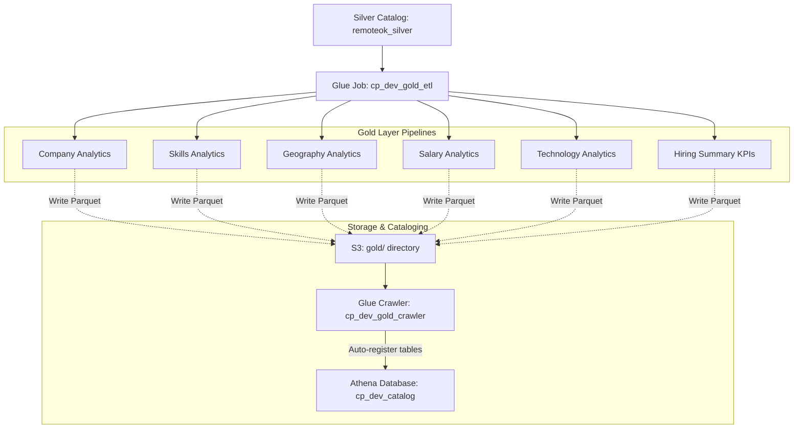

# Sprint 5 Gold Layer Analytics Documentation & Data Dictionary

This document details the architectural layout, data model dictionary, Glue configuration, and optimization principles for the CareerPulse **Gold Layer Analytics** platform.

---

## 1. ETL Architecture Overview

To minimize compute costs and execution startup overhead, all 6 analytical datasets are generated from a single orchestrated AWS Glue Job:

---

## 2. Gold Layer Data Dictionary

### Table 1: `gold_company`
* **Purpose**: Analyzes employer hiring behavior, recruitment metrics, and latest active postings.
* **Source Columns**: `company`, `id`, `location`, `salary_min`, `salary_max`, `position`, `date_posted`, `original`.
* **Primary Analytical Use Case**: Identifying top hiring brands and mapping market salary benchmarks per company.

| Column | Data Type | Aggregation / Extraction Rule | Description |
| :--- | :--- | :--- | :--- |
| `company` | `string` | Group Key | Employer name. |
| `total_jobs` | `bigint` | `count(1)` | Total postings. |
| `unique_locations` | `bigint` | `count(distinct location)` | Total distinct locations. |
| `avg_salary_min` | `double` | `avg(salary_min)` | Average minimum salary. |
| `avg_salary_max` | `double` | `avg(salary_max)` | Average maximum salary. |
| `original_jobs_count` | `bigint` | `sum(when(original == true))` | Count of original job listings. |
| `highest_paying_role` | `string` | `max(struct(salary_max, position))` | Position associated with the highest salary. |
| `latest_posting` | `timestamp`| `max(date_posted)` | Timestamp of latest posting. |

---

### Table 2: `gold_skills`
* **Purpose**: Maps developer skills demand and calculates salary premium margins.
* **Source Columns**: `tags`, `salary_min`, `salary_max`, `location`.
* **Primary Analytical Use Case**: Benchmarking high-income tags and evaluating key technologies.

| Column | Data Type | Aggregation / Extraction Rule | Description |
| :--- | :--- | :--- | :--- |
| `tag` | `string` | Group Key (exploded tags) | Normalized lowercase skill tag. |
| `job_demand_count` | `bigint` | `count(1)` | Total postings requiring skill. |
| `avg_salary_min` | `double` | `avg(salary_min)` | Average minimum salary. |
| `avg_salary_max` | `double` | `avg(salary_max)` | Average maximum salary. |
| `remote_jobs_count` | `bigint` | `sum(when(location rlike remote))` | Postings flagged remote. |
| `salary_premium` | `double` | `avg(salary_max) - overall_avg` | Salary difference from market baseline. |

---

### Table 3: `gold_geography`
* **Purpose**: Tracks job volumes, salary ranges, and company counts across standard geographical targets.
* **Source Columns**: `location`, `salary_min`, `salary_max`, `company`.
* **Primary Analytical Use Case**: Regional analysis and onsite/hybrid/remote employment distributions.

| Column | Data Type | Aggregation / Extraction Rule | Description |
| :--- | :--- | :--- | :--- |
| `country` | `string` | Group Key (Parsed country) | Standardized country (e.g. USA, UK, Canada). |
| `region` | `string` | Group Key (Parsed region type) | onsite, hybrid, or remote classification. |
| `jobs_count` | `bigint` | `count(1)` | Total postings. |
| `avg_salary_min` | `double` | `avg(salary_min)` | Average minimum salary. |
| `avg_salary_max` | `double` | `avg(salary_max)` | Average maximum salary. |
| `company_count` | `bigint` | `count(distinct company)` | Total distinct active companies. |
| `remote_count` | `bigint` | `sum(when(remote_flag))` | Count of remote listings. |
| `onsite_count` | `bigint` | `sum(when(onsite_flag))` | Count of onsite listings. |
| `hybrid_count` | `bigint` | `sum(when(hybrid_flag))` | Count of hybrid listings. |

---

### Table 4: `gold_salary`
* **Purpose**: Evaluates market distribution within configurable salary bands.
* **Source Columns**: `salary_max`, `salary_min`.
* **Primary Analytical Use Case**: Trend tracking across seniority brackets.

| Column | Data Type | Aggregation / Extraction Rule | Description |
| :--- | :--- | :--- | :--- |
| `salary_tier` | `string` | Group Key (Conditional tiering) | Salary band name. |
| `jobs_count` | `bigint` | `count(1)` | Total postings in tier. |
| `avg_salary_min` | `double` | `avg(salary_min)` | Average minimum salary in tier. |
| `avg_salary_max` | `double` | `avg(salary_max)` | Average maximum salary in tier. |

---

### Table 5: `gold_technology`
* **Purpose**: Tracks developer framework and language adoption dynamics.
* **Source Columns**: `tags`, `salary_min`, `salary_max`, `company`.
* **Primary Analytical Use Case**: Tech stack adoption trends and top recruiting employers per tag.

| Column | Data Type | Aggregation / Extraction Rule | Description |
| :--- | :--- | :--- | :--- |
| `tech_tag` | `string` | Group Key (Exploded, lower/trim) | Normalized developer tag. |
| `job_demand_count` | `bigint` | `count(1)` | Total postings. |
| `avg_salary_min` | `double` | `avg(salary_min)` | Average minimum salary. |
| `avg_salary_max` | `double` | `avg(salary_max)` | Average maximum salary. |
| `top_company` | `string` | `max(struct(job_count, company))` | Employer offering the most jobs for tag. |

---

### Table 6: `gold_summary`
* **Purpose**: Exposes static dashboard landing KPI stats.
* **Source Columns**: `id`, `company`, `location`, `salary_min`, `salary_max`.
* **Primary Analytical Use Case**: Exposes metrics directly to APIs serving frontend metrics.

| Column | Data Type | Aggregation / Extraction Rule | Description |
| :--- | :--- | :--- | :--- |
| `total_jobs` | `bigint` | `count(1)` | Total listings. |
| `total_companies` | `bigint` | `count(distinct company)` | Total distinct active companies. |
| `total_locations` | `bigint` | `count(distinct location)` | Total distinct raw locations. |
| `remote_jobs` | `bigint` | `sum(when(remote_flag))` | Total remote listings. |
| `remote_percentage` | `double` | `(remote_jobs / total_jobs) * 100`| Percentage of remote jobs. |
| `average_salary` | `double` | `avg((sal_min + sal_max) / 2)` | Average middle salary. |
| `highest_salary` | `bigint` | `max(salary_max)` | Highest single salary ceiling. |
| `highest_paying_company`| `string`| `max(struct(salary_max, company))` | Top paying employer. |
| `generation_timestamp` | `timestamp`| `current_timestamp()` | Execution timestamp. |

---

## 3. Athena Integration & Crawler Configuration

- **Crawler Name**: `cp_dev_gold_crawler`
- **Prefix**: `gold_`
- **Output Catalog Database**: `cp_dev_catalog`
- **Execution Target S3 path**: `s3://cp-dev-datalake-321422008826/gold/`

Because the 6 datasets are stored in separate folders inside the target directory, the Glue Crawler registers them automatically as 6 separate tables: `gold_company`, `gold_skills`, `gold_geography`, `gold_salary`, `gold_technology`, and `gold_summary`.

---

## 4. Cost Considerations & Best Practices

1. **Single Job Consolidation**:
   - Reduces execution startup overhead (Glue Spark clusters take ~1 minute to spin up). By running a single consolidated job, we pay the spin-up price once instead of 6 times.
2. **Snappy Parquet Compression**:
   - Reduces S3 storage cost and speeds up Athena queries because parquet is columnar and Snappy is optimized for speed/space.
3. **Partition Pruning**:
   - Athena queries on Silver prune partitions by `year/month/day` before computing aggregations, minimizing bytes scanned.
4. **Job Bookmarks**:
   - Ensures that only new partition paths are processed in incremental runs, keeping Glue compute times minimal as data grows.
