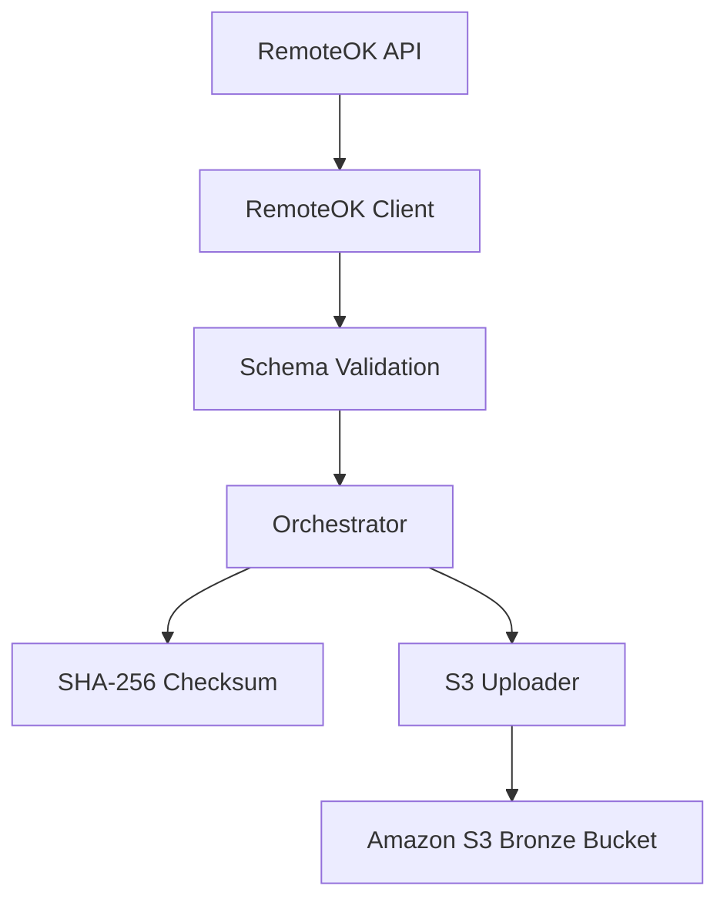

# Ingestion Architecture — CareerPulse

This document describes the design, flow, and production capabilities of the CareerPulse Bronze Layer ingestion pipeline.

## Production Quality Features

### 1. Unique Execution IDs
Every pipeline run generates a unique execution ID formatted as `YYYYMMDDTHHMMSSZ-suffix` (e.g. `20260710T184637Z-6d244b`) utilizing:
- ISO 8601 formatted UTC timestamp of the execution start.
- A 6-character random hex suffix to ensure absolute uniqueness.
This ID is injected into every logger message via a `PipelineLoggerAdapter` to trace individual executions across logs and services.

### 2. Pipeline Metrics
Observability is a core pillar of CareerPulse. Every execution captures:
- `api_response_time_ms`: Time taken to retrieve data from RemoteOK API.
- `jobs_file_size_bytes`: Raw payload size in bytes.
- `jobs_upload_duration_ms`: Duration of the jobs data upload to S3.
- `metadata_upload_duration_ms`: Duration of the metadata helper upload.
- `pipeline_duration_ms`: Total execution time from start to finish.

### 3. Data Integrity & SHA-256 Checksum
To verify that the raw data in S3 has not been corrupted or altered, a SHA-256 hash checksum of the serialized jobs JSON is computed:
1. Serialize the list of jobs into a UTF-8 encoded string payload.
2. Generate the hex digest using `hashlib.sha256()`.
3. Save it to the companion metadata file as `"sha256": "..."` and log it.
ETag validation checks the integrity at S3 upload boundaries.

### 4. Upload Retry with Exponential Backoff
The S3 uploader (`ingestion/uploader.py`) implements transient failure recovery when executing `put_object()` calls:
- Max Retries: Configured via `S3_MAX_RETRIES` (default: 3).
- Backoff Pattern: `S3_BACKOFF_FACTOR * (2 ** (attempt - 1))`.
- Error Isolation: Only transient errors (like `SlowDown`, `RequestLimitExceeded`, network timeouts, 5xx server faults) trigger retry sleep blocks. Permanent errors (e.g., `NoSuchBucket` or AWS credential authorization failures) fail immediately to prevent lockups.

### 5. Pipeline Status Enum
Ingestion outcomes are classified under a strict `PipelineStatus` enum:
- `SUCCESS`: Ingestion and uploads completed successfully.
- `FAILED`: Pipeline halted due to an API or S3 failure.
- `VALIDATION_FAILED`: API response violated structural contracts.
- `UNKNOWN`: Terminated by an unhandled Python exception.
- `PARTIAL_SUCCESS`: Some files uploaded, others failed (reserved for multi-source execution).
