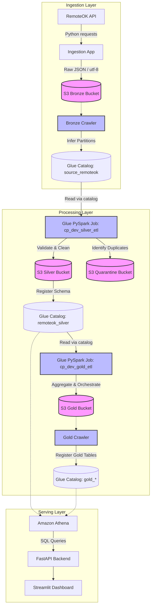
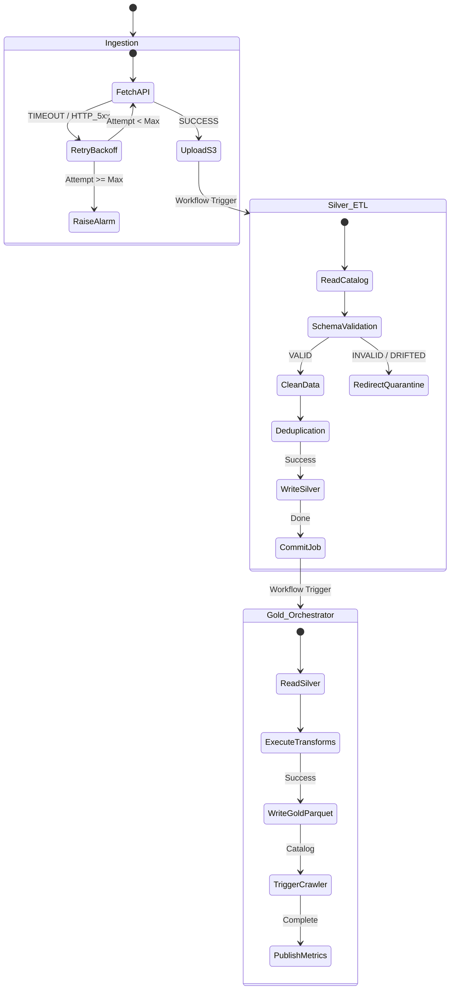

# Master Pipeline Architecture Documentation

This document describes the end-to-end cloud-native architecture of **CareerPulse** – an interview-quality, production-ready Data Lakehouse platform built on AWS.

---

## 1. High-Level Data Flow



---

## 2. Storage Directory Layout (S3 Lakehouse)

The datalake is structured into distinct, clean layers enforcing separation of concerns, storage formats, and partitioning:

```text
s3://cp-dev-datalake-321422008826/
├── scripts/
│   ├── silver_etl.py                         # Production PySpark Silver ETL script
│   └── gold_etl.py                           # Consolidated PySpark Gold ETL script
├── bronze/
│   └── source=remoteok/
│       └── year=YYYY/month=MM/day=DD/
│           ├── jobs_timestamp.json           # Raw JSON API payload (Immutable, UTF-8 clean)
│           └── jobs_timestamp.metadata.json  # Manifest containing pipeline metrics & hashes
├── silver/
│   └── source=remoteok/
│       └── year=YYYY/month=MM/day=DD/
│           └── *.snappy.parquet             # Clean, deduped, schema-validated columnar data
├── quarantine/
│   └── source=remoteok/
│       └── reason=duplicate/
│           └── year=YYYY/month=MM/day=DD/
│               └── *.snappy.parquet         # Records rejected due to duplication (for audits)
└── gold/
    ├── company/
    │   └── *.snappy.parquet                 # Company job counts, dates, and salary indexes
    ├── skills/
    │   └── *.snappy.parquet                 # Developer skill demands and salary premium indexes
    ├── geography/
    │   └── *.snappy.parquet                 # Work mode distributions (Remote/Hybrid/Onsite)
    ├── salary/
    │   └── *.snappy.parquet                 # Volume counts by salary tier brackets
    ├── technology/
    │   └── *.snappy.parquet                 # Dynamic tool & stack hiring indexes
    └── summary/
        └── *.snappy.parquet                 # High-level landing page dashboard KPI metrics
```

---

## 3. Failure Recovery & Error Handling Flow

To ensure high availability and self-healing pipelines in production, CareerPulse integrates robust recovery flows across all stages:



* **Ingestion Resiliency:** Employs exponential backoff retry policies for fetching RemoteOK API listings and persisting raw datasets to S3.
* **Silver ETL Drift Protection:** Dynamically inspects the Glue catalog struct schema array fieldNames. If nested API properties (e.g. `original`, `salary_max`) are omitted due to upstream schema drifts, Silver ETL maps them to native `NULL` types instead of crashing the job run.
* **Write Transactionality:** AWS Glue jobs commit states atomically. Failed job runs rollback and notify CloudWatch for alerts.

---

## 4. Operational Monitoring & Logging

* **Glue Job Bookmarks:** Bookmarks are fully enabled on `cp_dev_silver_etl` and `cp_dev_gold_etl`. During recurring batch runs, only newly added Bronze/Silver partitions are processed, preventing costly redundant runs.
* **CloudWatch Log Streams:** Glue container logs (stdout and stderr) are pushed directly to Amazon CloudWatch logs under prefix `/aws-glue/jobs/`.
* **Platform Metrics:** Job runs log complete pipeline metrics to metadata JSON files inside `bronze/` and output execution logs.
