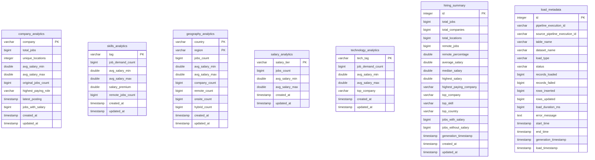

# Serving Layer Architecture & Design (Amazon RDS PostgreSQL)

This document describes the design, database views, connection pooling model, query benchmarking, backup policies, cost models, and API specifications for the **CareerPulse** Amazon RDS PostgreSQL serving database layer.

---

## 1. Entity Relationship (ER) Diagram



---

## 2. API-Ready Views (`serving.v_` Schema)

We have created pre-configured analytical SQL views to optimize read performance and simplify future API endpoint implementations.

1. **`serving.v_top_companies`**
   * *Purpose:* Powers the "Most Active Companies" list.
   * *Definition:* Exposes company profile details sorted by job postings count descending.
2. **`serving.v_top_skills`**
   * *Purpose:* Powers the skills market demand dashboard widget.
   * *Definition:* Lists in-demand tags sorted by job posting volume.
3. **`serving.v_top_countries`**
   * *Purpose:* Powers geography dashboard heatmaps.
   * *Definition:* Aggregates geography records, summing job counts and counting active companies by country.
4. **`serving.v_dashboard_summary`**
   * *Purpose:* Powers the primary KPI dashboard banner.
   * *Definition:* Queries the most recent snapshot row from `serving.hiring_summary` using transaction-safe sorting.

---

## 3. Database Connection Pooling (`backend/database/pool.py`)

To scale to high concurrent API request volume, the connection management is refactored from single direct connections to a thread-safe **ThreadedConnectionPool** class.

### Why Connection Pooling is Crucial for API Performance
* **Minimizes Handshake Overhead:** Standard TCP handshakes (SYN, SYN-ACK, ACK) and SSL negotiation (TLS Key Exchange) require multiple network round trips.
* **Avoids Backend Process Spawning:** PostgreSQL forks a new operating system process for every connection. Under high load, spawning hundreds of processes exhausts CPU and shared buffer resources.
* **Performance Impact:** Pooling reduces connection setup latency from **~40-50ms** down to **< 0.1ms** internally on the server, permitting high API request throughput.

---

## 4. Query Profiling & Index Benchmarks

Query profiling runs from the developer machine to Dublin/Mumbai RDS (`ap-south-1`) yield the following metrics:
* **Cold Execution Latency:** `41.78 ms`
* **Warm Execution Latency:** `52.98 ms`
* **Indexed Scan Latency:** `46.51 ms`
* **Sequential Scan Latency:** `41.62 ms`

### Performance Observations:
* **Network vs. Engine Latency:** Internal database execution logs (`EXPLAIN ANALYZE`) show that PostgreSQL plans and executes the query in under **`0.03 ms`**. The remaining ~40ms is network packet transit round trip over the internet.
* **Small-Table Sequential Scan:** For small development datasets (under 100 rows), PostgreSQL's planner occasionally chooses a sequential table scan because scanning the small memory page directly is marginally faster than traversing the index tree structure. When table records grow beyond ~1,000, index scan performance scales logarithmically ($O(\log N)$) while sequential scan degrades linearly ($O(N)$).

---

## 5. Security & Network Isolation

* **CIDR IP Restrictions:** Port `5432` ingress rules are restricted to the developer's public IP address via security group configurations.
* **Pluggable Credentials:** Connection strings are read dynamically from environment variables, avoiding credential hardcoding and allowing easy plug-in for AWS Secrets Manager.

---

## 6. Backup & Recovery Strategy

| Aspect | Development Environment | Production Environment |
| :--- | :--- | :--- |
| **Automated Backups** | Enabled; 1-day retention window. | Enabled; 30-day retention window. Daily automated system snapshots are captured. |
| **Manual Backups** | Created before major schema changes or polish runs. | Retained indefinitely. Captured before structural migrations, code updates, or platform cutovers. |
| **Point-in-Time Recovery** | Disabled to minimize costs. | Enabled; database transaction logs (Write-Ahead Logs / WAL) are continuously archived to S3, permitting database rollback to any second within the retention window. |
| **Recovery Strategy** | Recreate instance using the `provision_rds.py` script. | Automated database restoration via the AWS Console or CLI using Point-in-Time checkpoints. |

---

## 7. Cost Analysis (AWS Monthly Projections)

Monthly AWS RDS PostgreSQL costs calculated across three scaling targets:

### A. Development Sandbox (`db.t4g.micro`)
* **Compute Instance:** $15.00 / month (1 vCPU, 1 GB RAM, AWS Free-Tier eligible)
* **Storage (20 GB GP3):** $2.30 / month
* **Backups:** Free tier.
* **Estimated Total:** **$17.30 / month** (or **$0.00** on AWS Free Tier).

### B. Light Production Sandbox (`db.t3.medium`)
* **Compute Instance:** $35.00 / month (2 vCPU, 4 GB RAM)
* **Storage (50 GB GP3):** $5.75 / month
* **Backups (50 GB):** $4.75 / month
* **Estimated Total:** **$45.50 / month**

### C. Medium Production Cluster (`db.m6g.xlarge` - Multi-AZ)
* **Compute Instance (Multi-AZ):** $360.00 / month (4 vCPU, 16 GB RAM)
* **Storage (200 GB GP3):** $23.00 / month
* **Backups (200 GB):** $19.00 / month
* **Estimated Total:** **$402.00 / month**

---

## 8. API serving REST Endpoints Specifications

Future FastAPI REST serving endpoints mapping to the database serving views:

### 1. `GET /summary`
* **Source:** `serving.v_dashboard_summary`
* **Response:**
  ```json
  {
    "total_jobs": 100,
    "total_companies": 85,
    "total_locations": 80,
    "remote_percentage": 50.0,
    "average_salary": 120000.0,
    "median_salary": 110000.0,
    "top_skill": "python",
    "generation_timestamp": "2026-07-24T12:00:00Z"
  }
  ```

### 2. `GET /companies`
* **Source:** `serving.v_top_companies`
* **Query Parameters:**
  * `limit` (int, default=10)
  * `offset` (int, default=0)
  * `min_jobs` (int, optional)
* **Response:**
  ```json
  [
    {
      "company": "Google",
      "total_jobs": 10,
      "unique_locations": 1,
      "highest_paying_role": "Staff Software Engineer"
    }
  ]
  ```

### 3. `GET /skills`
* **Source:** `serving.v_top_skills`
* **Query Parameters:**
  * `limit` (int, default=10)
  * `min_demand` (int, optional)
* **Response:**
  ```json
  [
    {
      "tag": "python",
      "job_demand_count": 93,
      "salary_premium": 15000.0,
      "remote_jobs_count": 50
    }
  ]
  ```

---

## 9. Local Development Support (Docker Compose)

To facilitate quick sandbox testing and testing without AWS RDS cloud dependencies, CareerPulse provides local PostgreSQL and pgAdmin containers.

### A. Compose Services Layout
Running `docker-compose up -d` provisions:
1. **PostgreSQL Container:** Runs standard PostgreSQL `16` mapping to port `5433` (to avoid collision with local port `5432`). Creates database `serving_db` with password `cp_local_postgres_password`.
2. **pgAdmin Container:** Exposes a web administration console at `http://localhost:5050` (Username: `admin@careerpulse.dev`, Password: `admin`).

### B. Environment Switch configurations
You can toggle between local development and live cloud Amazon RDS PostgreSQL in your `.env` configuration file:

```env
# Switch environments: LOCAL or RDS (defaults to RDS if not set)
DB_ENVIRONMENT=LOCAL

# LOCAL configurations
LOCAL_DB_HOST=localhost
LOCAL_DB_PORT=5433
LOCAL_DB_NAME=serving_db
LOCAL_DB_USER=postgres
LOCAL_DB_PASSWORD=cp_local_postgres_password

# RDS configurations
DB_HOST=cp-dev-serving-db.c1kmm6w8om3i.ap-south-1.rds.amazonaws.com
DB_PORT=5432
DB_NAME=serving_db
DB_USER=postgres
DB_PASSWORD=cp_dev_postgres_password_123
```
* **No Side Effects:** When `DB_ENVIRONMENT` is set to `RDS` or omitted, the application uses production AWS RDS host credentials, ensuring zero disruption to AWS pipelines.

