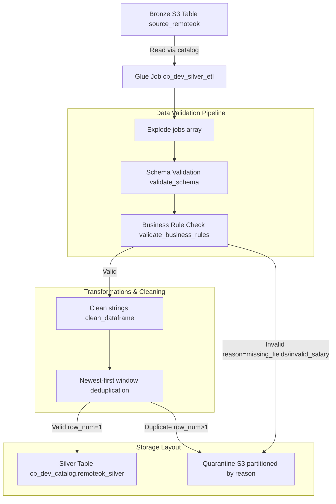

# Sprint 4 Silver Layer ETL Architecture

This document describes the design, implementation, and configuration of the CareerPulse **Silver Layer ETL** pipeline.

---

## 1. ETL Pipeline Overview

The Silver ETL pipeline transforms raw, schema-inferred Bronze JSON payloads into clean, validated, deduplicated, and typed Parquet datasets in the Silver layer.

---

## 2. Glue Job Configuration

- **Job Name**: `cp_dev_silver_etl`
- **Glue Version**: `5.0` (supports PySpark 3.4 and Python 3.10)
- **Worker Type**: `G.1X`
- **Number of Workers**: `2` (development/testing configuration)
- **Job Timeout**: `10` minutes
- **IAM Role**: `cp-dev-glue-role`
- **Bookmarks**: Enabled (`--job-bookmark-option job-bookmark-enable`)
- **Parameters**:
  - `--pipeline_execution_id`: Unique run execution ID
  - `--s3_bucket`: S3 bucket name

---

## 3. Data Validation & Quality Rules

### Schema validation (`validate_schema`)
Projects fields from the exploded nested array structures and explicitly casts them:
- `id` $\rightarrow$ `LongType`
- `salary_min`, `salary_max` $\rightarrow$ `IntegerType`
- `original` $\rightarrow$ `BooleanType`
- `epoch` $\rightarrow$ `LongType`

### Business rules (`validate_business_rules`)
- **Required Columns**: `id`, `company`, and `position` must not be null or empty. Records failing this check are rejected with `reason='missing_required_fields'`.
- **Salary Check**: If both `salary_min` and `salary_max` are present, `salary_max` must be $\ge$ `salary_min`. Records failing this check are rejected with `reason='invalid_salary'`.

### Deduplication
Duplicates are identified using window functions over `id`, ordering by `epoch` descending:
- The row with `row_number == 1` is preserved in the Silver output dataset.
- Discarded duplicates (`row_number > 1`) are logged and archived in quarantine with `reason='duplicate'`.

---

## 4. Storage Partitioning Strategy

### Silver Layer
Valid cleaned records are stored in optimized **Parquet format with Snappy compression**, partitioned by S3 prefixes:
`s3://<bucket>/silver/source=remoteok/year=YYYY/month=MM/day=DD/`

### Quarantine Layer
Failed records are written in JSON format, partitioned by **failure reason** and date:
`s3://<bucket>/quarantine/source=remoteok/reason=<failure_reason>/year=YYYY/month=MM/day=DD/`

---

## 5. Metadata and Operations Tracking

Each run outputs an operational JSON metadata payload to S3 at `s3://<bucket>/metadata/silver_etl/<execution_id>.metadata.json`:
- `input_records`: Count of exploded Bronze records
- `output_records`: Count of Silver Parquet records
- `rejected_records`: Count of validation rule failures
- `duplicate_records`: Count of window-deduplicated rejections
- `null_salary_count`: Records with empty/null salary values
- `validation_failure_count`: Total rejected records
- `processing_duration_ms`: Run duration
- `output_size_bytes`: Total byte size of Silver partition output in S3
- `schema_version`: `1.0`
- `pipeline_execution_id`: Trace ID
- `transformation_timestamp`: Run timestamp (UTC)
