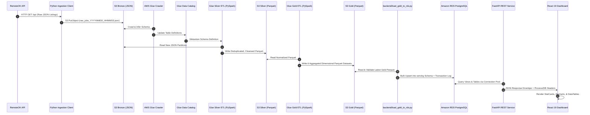

# CareerPulse Data Flow & Lifecycle Specification

## 1. Overview

This document specifies the complete data lifecycle of the CareerPulse platform—from external job board scraping to final rendering in the executive dashboard. It details the exact transformation stages, schema evolutions, and the critical distinction between **Current Snapshot** and **Cumulative Dimension** datasets.

---

## 2. End-to-End Pipeline Stages

---

## 3. Data Transformation Stages

### Stage 1: Ingestion & Raw Landing (Bronze)
- **Source:** RemoteOK Public API (`https://remoteok.com/api`).
- **Processing:** `ingestion/main.py` fetches the raw job list, sanitizes headers, appends extraction timestamps (`ingestion_timestamp`), and stores records as an uncompressed, newline-delimited JSON payload in S3.
- **Storage Path:** `s3://<S3_BUCKET>/bronze/source=remoteok/year=YYYY/month=MM/day=DD/`
- **Guarantees:** Immutability; exact historical record of upstream responses.

### Stage 2: Schema Discovery (Glue Catalog)
- **Trigger:** Scheduled AWS Glue Crawler (`cp_dev_bronze_crawler`).
- **Function:** Scans Bronze partition prefixes, infers unified schema types, and registers external table metadata in the AWS Glue Data Catalog (`cp_dev_catalog.bronze_remoteok`).

### Stage 3: Normalization & Cleansing (Silver)
- **Engine:** PySpark running on AWS Glue (`cp_dev_silver_etl`).
- **Transformations Applied:**
  1. **Schema Standardization:** Casts raw string fields into strongly-typed primitives (`id` $\rightarrow$ `BIGINT`, `date` $\rightarrow$ `TIMESTAMP`, `tags` $\rightarrow$ `ARRAY<STRING>`).
  2. **Salary Extraction:** Regular expression parsing extracts lower and upper salary bounds (`salary_min`, `salary_max`) from freeform compensation text. Normalizes values to annualized USD.
  3. **Location Categorization:** Classifies jobs into `remote_flexible`, `country_specific`, or `regional_restricted` based on location text patterns.
  4. **Deduplication:** Window partition on `(company, position, date)` drops duplicate listings while retaining the latest record.
- **Output:** Snappy-compressed Apache Parquet at `s3://<S3_BUCKET>/silver/jobs/`.

### Stage 4: Dimensional Aggregation (Gold)
- **Engine:** PySpark running on AWS Glue (`cp_dev_gold_etl`).
- **Datasets Produced:**
  1. **`company` (`s3://.../gold/company/`):**
     - Aggregates posting counts, unique location count, average minimum/maximum salary, and highest paying role by employer.
  2. **`skills` (`s3://.../gold/skills/`):**
     - Explodes technical tag arrays, computing total demand count, average salary benchmarks, and compensation premiums relative to market averages.
  3. **`technology` (`s3://.../gold/technology/`):**
     - Filters and maps developer tools and runtime platforms to measure hiring demand and primary employers.
  4. **`geography` (`s3://.../gold/geography/`):**
     - Aggregates listings by country and administrative region, breaking down remote, onsite, and hybrid counts.
  5. **`salary` (`s3://.../gold/salary/`):**
     - Buckets positions into standard compensation tiers: `Entry (< 50k)`, `Mid (50k-100k)`, `Staff (150k+)`, and `Not Specified`.
  6. **`summary` (`s3://.../gold/summary/`):**
     - Single-row platform snapshot containing total active jobs, unique company count, remote percentage, and market salary median.

### Stage 5: Serving Layer Loading (PostgreSQL)
- **Script:** `backend/load_gold_to_rds.py`
- **Execution Flow:**
  1. Fetches latest Gold Parquet files from S3 using boto3.
  2. Performs schema validation against Pydantic-defined schemas.
  3. Executes an atomic transaction:
     - Truncates/upserts data into `serving.company_analytics`, `serving.skills_analytics`, etc.
     - Logs load timestamp, source row counts, and target row counts into `serving.load_metadata`.
     - Automatically updates precomputed views (`v_top_companies`, `v_top_skills`, `v_dashboard_summary`, `v_dataset_status`).

---

## 4. Snapshot vs. Cumulative Dimension Semantics

Understanding the semantic boundary between snapshot and cumulative dimensions is critical for accurate analytical interpretation:

| Dimension | Type | Row Count | Behavioral Semantics |
| :--- | :--- | :--- | :--- |
| **Hiring Summary (`hiring_summary`)** | Snapshot | 1 row | Represents **strictly the latest scraping run** (e.g., exactly 99 verified jobs). |
| **Company Analytics (`company_analytics`)** | Snapshot | 175 companies | Aggregated counts sum to the total jobs in the current snapshot window. |
| **Salary Analytics (`salary_analytics`)** | Snapshot | 4 tiers | Tiers (`Entry`, `Mid`, `Staff`, `Not Specified`) sum exactly to the snapshot total (e.g., $3 + 3 + 8 + 85 = 99$). |
| **Skills Analytics (`skills_analytics`)** | Normalized Dimension | 126 skills | Skill tags are many-to-many; total tag frequencies naturally exceed the job count (e.g., `exec` appears in 69 jobs). |
| **Geography Analytics (`geography_analytics`)** | Cumulative Dimension | 106 locations | Preserves cumulative geographic distributions across ingestion cycles. |

> [!NOTE]
> **Dataset Semantics Notice on Geography:** The geography page prominently features a disclaimer banner informing users that geographic distributions reflect cumulative analytics dimension buckets and should not be confused with a pure single-run 99-job snapshot.
